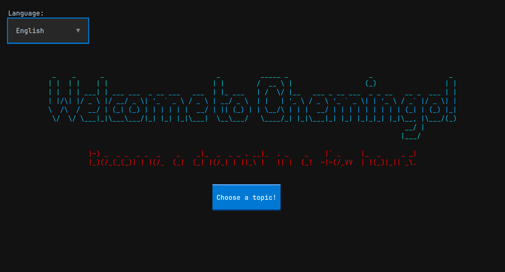
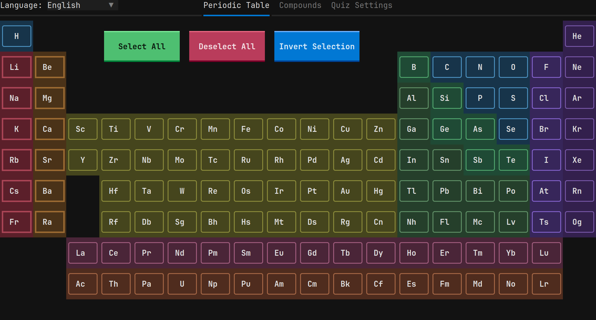
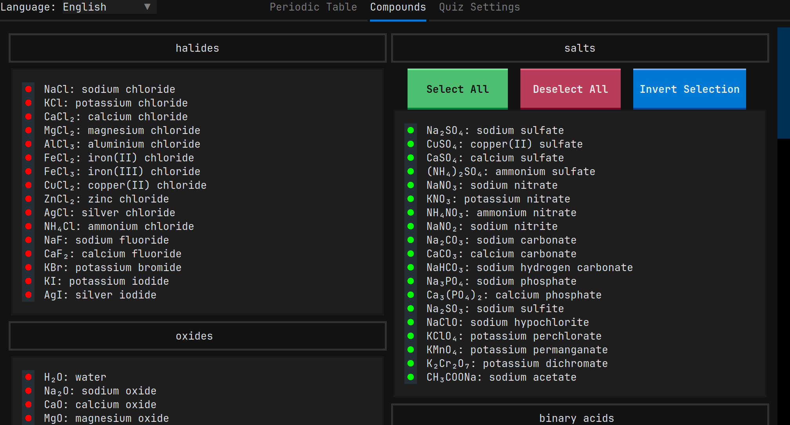
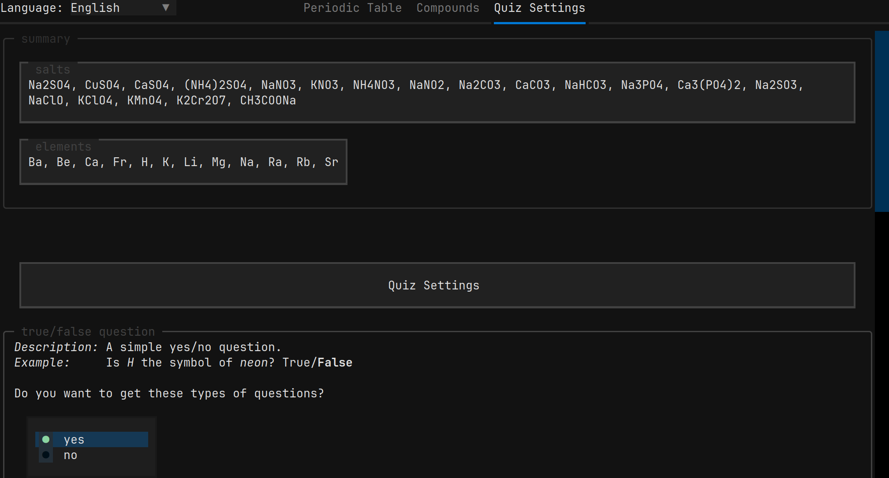
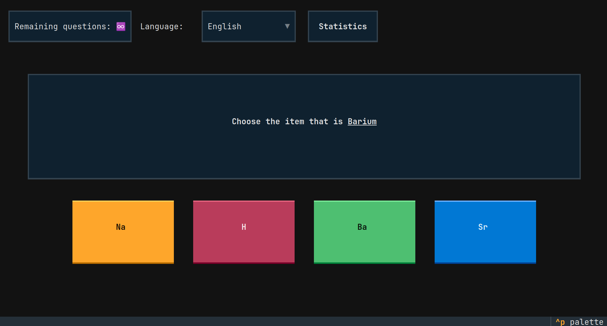

# Chemingo

Chemingo is a terminal-based chemistry quiz app written in Python with [Textual](https://textual.textualize.io/).

It lets you choose the chemical elements and compounds you want to practise, configure the quiz, and then test yourself using several different question types. The interface is fully interactive, can be controlled with a mouse, and supports multiple languages.

Chemingo was originally created as my final project for [**CS50's Introduction to Programming with Python (CS50P)**](docs/harvard/README.md). \
[View CS50P certificate](https://cs50.harvard.edu/certificates/a6ba7939-8156-4a5b-80ab-a69f252a2bf2)

---

## What does it look like?

### Welcome Screen


### Periodic Table


### Compounds


### Quiz Settings


### Quiz


---

## Features

### Interactive periodic table

Choose exactly which elements you want to practise directly from the periodic table. You can select elements one by one or use shortcuts to speed up larger selections.

### Chemical compounds

Chemingo also includes compounds divided into **12 categories**. You can select individual compounds or work with entire groups at once.

### Three question types

The quiz can generate three different kinds of questions:

- **True / False**  
  Decide whether two pieces of chemical information belong together.

- **Multiple choice**  
  Choose the correct answer from four options.

- **Typing**  
  Type the correct element name, symbol, compound name, or formula.

Typing questions also show how similar your answer was to the correct one, which can help distinguish a small typo from a completely wrong answer.

### Custom quiz settings

Before starting a quiz, you can choose:

- which question types are enabled,
- how many questions you want,
- or an unlimited number of questions.

### Statistics

During a quiz you can open the statistics screen to see your progress, selected items, enabled question types, correct and incorrect answers, and the number of remaining questions.

### 13 languages

The interface can be switched between **13 supported languages** while the application is running. The current screen updates immediately after changing the language.

### Mouse and keyboard controls

Although Chemingo runs entirely inside a terminal, it behaves more like a regular application than a traditional command-line program.

Most of the interface can be controlled with a mouse. The quiz screen also provides keyboard shortcuts, which are shown in the footer.

---

## How it works

A normal session looks like this:

1. Start Chemingo and continue from the welcome screen.
2. Select elements from the periodic table.
3. Select any compounds you also want to practise.
4. Choose the question types and quiz length.
5. Start the quiz.
6. Answer randomly generated questions.
7. Check your statistics whenever you want.

The application keeps the selected items, settings, language, and quiz statistics in a shared application state while it is running.

---

## Installation

Chemingo requires **Python 3.12.3 or newer**.

The project is currently tested with:

- Python 3.12.3 on Linux
- Python 3.14.6 on Windows
- Textual 5.3.0
- textual-pyfiglet 1.1.0

Clone the repository:

```bash
git clone https://github.com/Franta872/Chemingo.git
cd Chemingo
```

Creating a virtual environment is recommended.

### Linux / macOS

```bash
python3 -m venv .venv
source .venv/bin/activate
python -m pip install -r requirements.txt
python project.py
```

On some Debian/Ubuntu-based systems, you may need to install the venv package first:

```bash
sudo apt install python3-venv
```

### Windows PowerShell

```powershell
python -m venv .venv
.\.venv\Scripts\Activate.ps1
python -m pip install -r requirements.txt
python project.py
```

---

## Built with

- **Python**
- **Textual**
- **textual-pyfiglet**
- **JSON** for chemical and translation data

---

## Notes

Chemingo is a learning project, not a professional chemistry reference database. The main goal of the project was to practise Python, application structure, TUI development, working with data, testing, and building a larger project from start to finish.
